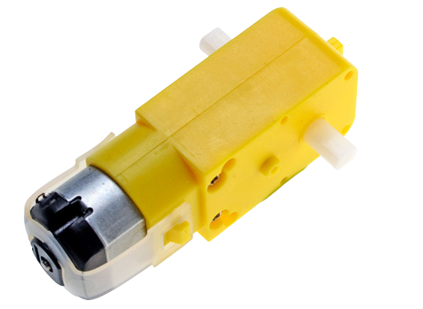

# TT DC Gear Motor Programming User Guide
In this guide, you will find a basic explanation and setup for utilizing a Raspberry Pi 3B+ (running Ubuntu Server 22.04) in conjunction with the DC gear motor component.\
This guide will **NOT** analyze the circuit necessary for the component, since it has been used a raspberry shield comprehensive by motor driven.
For deeped understanding of the motor driver, look [here](https://www.electronicshub.org/controlling-a-dc-motor-with-raspberry-pi/). 

## Understanding the TT DC Gear Motor
<p align="center">
  
</p>

The "classic yellow" TT DC gear motor (datasheet <a href="https://media.digikey.com/pdf/Data%20Sheets/Adafruit%20PDFs/3777_Web.pdf">here</a>) is a popular motor used for robotics applications. These motors typically operate within a voltage range of 3V to 6V and are designed for low-current applications. To control them with RaspberryPi, you use PWM for speed control and require an H-bridge motor driver to pass higher voltage/current to the motors. The reason why you cannot directly plug the motor to the RaspberryPi pins is that the GPIO pins provide a current of only 16mA per pin, which is not enough to power a DC motor. To provide the required current and control directionality, you need to use a motor driver such as L298N driver.

By rapidly switching the power on and off (know as Pulse Width Modulation technique) enables us to change the average value of the voltage that is being sent to the electrical equipment, controlling the angular speed of the motor. 

## Configuration and Setup
To view essential information about Raspberry Pi pins, including pin enumeration, use the following command:
```
pinout
```

The following pin numbers will be based on **GPIO's enumeration**:
- Connect the clockwise direction channel to PIN 21
- Connect the counterclockwise direction channel to PIN 20
- Connect the PWM channel to PIN 0


## Running The TT DC Gear Motor Test
To evaluate the TT DC gear motor, two tests have been created. The motor is moved forward and backward by the first program (written in Python using the RPi library), while the motor's speed is increased from 10% to 50% by the second program (written in Cpp using the wiringPi library).

To get started, follow these steps:
1. Clone the repository onto your Raspberry Pi 3B+ using the terminal:
```
cd ~/
git clone https://github.com/mataruzz/raspberryPi_components_tests.git

```

2. To run the **change direction test**, execute the script:
```
cd ~/raspberryPi_components_tests/TT_DC_gear_motor
./dc_motor_change_dir.py
```

3. To run the **change speed test**, first make sure to have installed and build wiringPi library, for example:
```
cd ~/
git clone https://github.com/WiringPi/WiringPi.git
cd WiringPi && ./build
```
4. Compile the C++ script (not necessary):
```
g++ -o dc_motor_change_speed dc_motor_change_speed.cpp -lwiringPi
```
5. Execute the test:
```
cd ~/raspberryPi_components_tests/TT_DC_gear_motor
./dc_motor_change_speed
```
     


